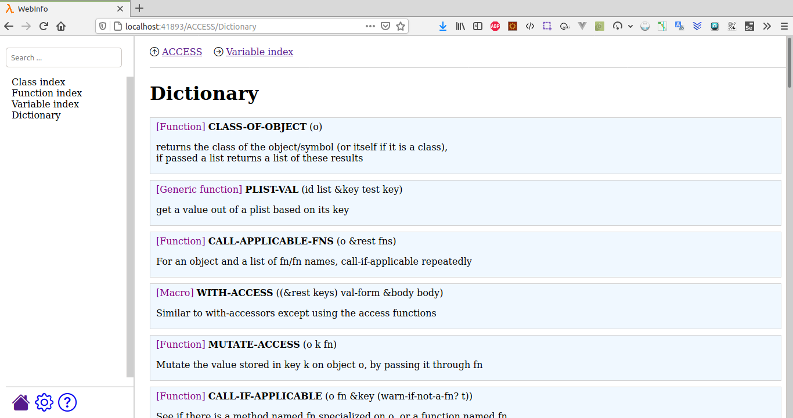
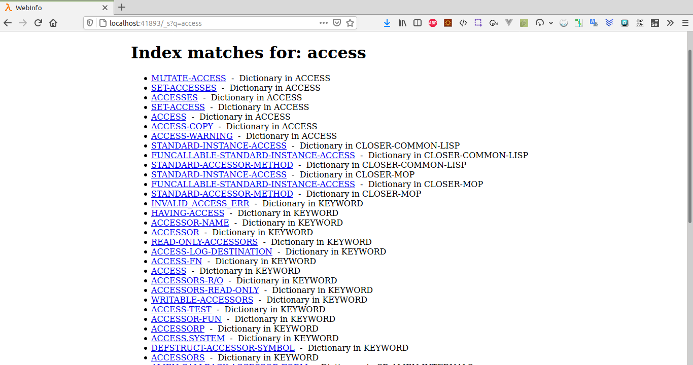

# cl-livedocs

Live web documentation browser for Common Lisp. Based on Webinfo project.

## Use

Evaluate:

```lisp
(cl-livedocs:start)
```

Then you can browse the documentation from your web browser.

Note that it takes a bit of time to start, as fulltext searching is enabled by default, and the indexing takes some time.

Run it like:
```lisp
(cl-livedocs:start :fulltext-search nil)
```

to disable fulltext search and a fast start.

## Screenshots





## License

GPL
